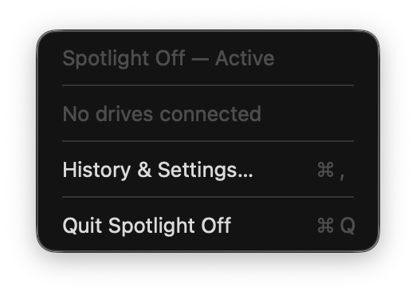
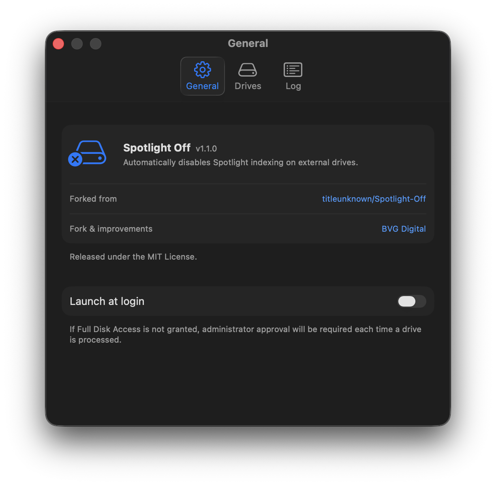
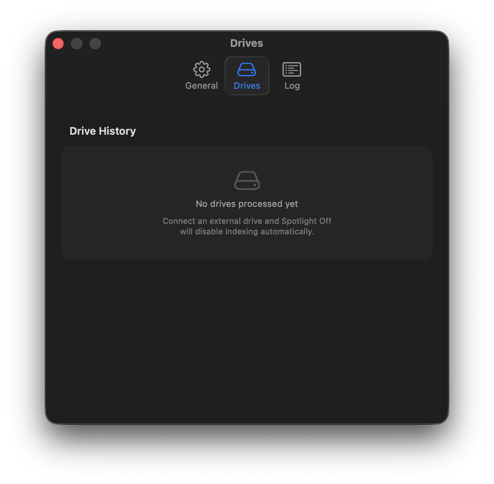
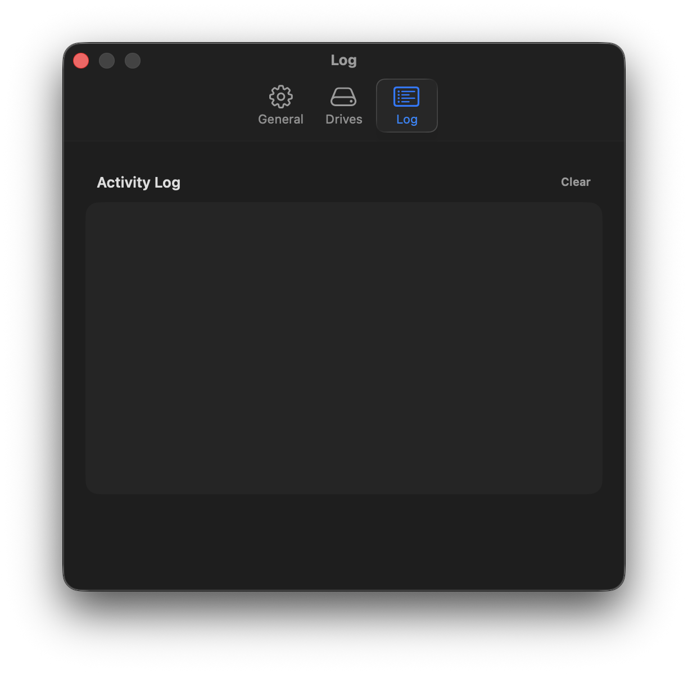

<div align="center">
  

  # Spotlight Off

  **Automatically disables Spotlight indexing on external drives the moment they're connected.**

  
  
  
  

</div>

---

> **Forked from [titleunknown/Spotlight-Off](https://github.com/titleunknown/Spotlight-Off)** — refactored for modern Swift concurrency, `@MainActor` isolation, and a redesigned tabbed settings UI.

---

## What it does

Every time you plug in an external drive, macOS quietly starts building a Spotlight index on it — consuming disk space and I/O you didn't ask for. **Spotlight Off** sits in your menu bar and takes care of it automatically.

- 🔌 **Detects** any external drive the moment it's mounted
- 🔍 **Checks** whether Spotlight indexing is currently enabled
- 🚫 **Disables** it instantly using `mdutil`, with a one-time admin prompt
- 📋 **Logs** every action in a live activity log inside the app
- 🚀 **Launches at login** so it's always running in the background

---

## Screenshots

<div align="center">
  
  <br/><br/>
  
  <br/><br/>
  
  <br/><br/>
  
</div>

---

## Requirements

- macOS 14 Sonoma or later (including macOS 26 Tahoe)
- Administrator access (required once, to run `mdutil`)

> **macOS 26 Tahoe note:** The app has been tested and works on macOS 26.3.1. Due to changes in how Tahoe handles SwiftUI `MenuBarExtra` scenes, you may see a harmless `[NSStatusItemView] No matching scene to invalidate` message in the system log. This does not affect functionality.

---

## Building from source

```bash
git clone https://github.com/BVG-Digital/Spotlight-Off.git
cd Spotlight-Off
open "Spotlight Off.xcodeproj"
```

Before building, update **Signing & Capabilities** in Xcode:

1. Set **Team** to `None` (or your own Apple ID for personal use)
2. Change the **Bundle Identifier** to your own (e.g. `com.yourname.Spotlight-Off`)
3. Build and run

No paid Apple Developer account is required to build and run locally.

---

## Usage

| Action | How |
|---|---|
| See recently processed drives | Click the menu bar icon |
| Open settings | Click **Settings…** or press ⌘, |
| View processed drives & exclusions | **Drives** tab in settings |
| Exclude a drive from processing | Right-click an entry in the Drives tab |
| Remove a history entry | Select it and press Delete |
| Enable launch at login | Toggle in the **General** tab |
| View activity log | **Log** tab in settings |
| Clear the log | Click **Clear** in the Log tab |
| Quit | Click **Quit Spotlight Off** in the menu |

---

## How it works

When a volume mounts, Spotlight Off:

1. Reads the volume's metadata flags to confirm it's a local, non-root external volume
2. Waits 1.5 seconds for the volume to fully settle
3. Runs `mdutil -s` to check whether indexing is currently enabled
4. If enabled, runs `mdutil -i off` via `osascript` with administrator privileges
5. Records the result in the persistent history log

All history is stored locally in `UserDefaults`. No network requests are ever made.

---

## What's changed from upstream

- **Swift concurrency**: `DriveMonitor` is `@MainActor`-isolated; process methods are `nonisolated`; background work uses `Task.detached` instead of `DispatchQueue.global`
- **Tabbed settings UI**: General, Drives, and Log tabs replace a single scrolling view
- **Modern SwiftUI APIs**: `foregroundStyle` throughout, `Form` + `Section` with `.formStyle(.grouped)` for a native System Settings appearance
- **Cleaner state management**: `LogStore` and `AppState` use `DispatchQueue.main.async` for safe UI updates without actor isolation conflicts

---

## License

MIT — see [LICENSE](LICENSE) for details.

Original work © 2026 titleunknown. Modifications © 2026 BVG Digital.
